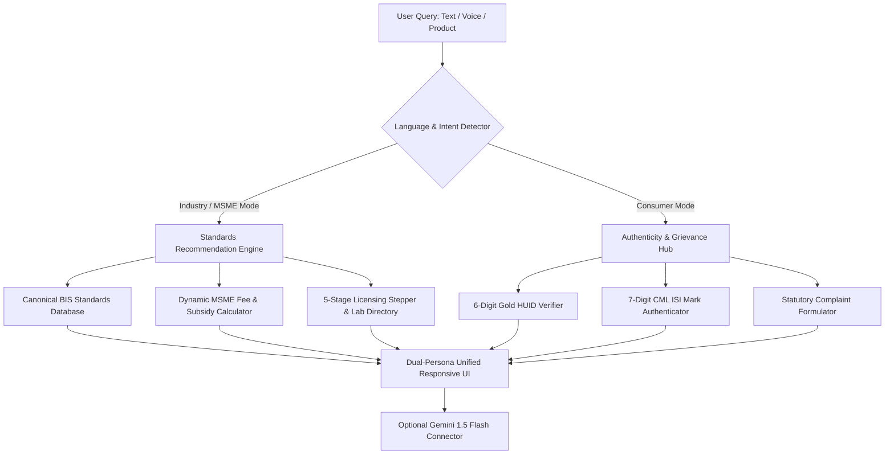

# 🇮🇳 ManakSetu (मानक सेतु)
### AI-Powered Intelligent Assistant for Indian Standards & BIS Services
**Smart India Hackathon (SIH 2026)** | **Problem Statement ID:** `26107`  
**Ministry:** Ministry of Consumer Affairs, Food & Public Distribution  
**Department:** Department of Consumer Affairs (DoCA) & Bureau of Indian Standards (BIS)  
**Institution:** Jamia Hamdard, New Delhi  
**Team:** SnippetSquad  

---

## 📌 Executive Summary

India has over **21,000+ Indian Standards (IS Codes)** published by the **Bureau of Indian Standards (BIS)**. However, over **70% of MSMEs, small manufacturers, and artisans** struggle with compliance friction:
- *Which Indian Standard applies to my product?*
- *Is my product covered under a Mandatory Quality Control Order (QCO)?*
- *What is the exact 5-step roadmap, laboratory testing parameters, and fee structure?*
- *How can everyday consumers verify genuine ISI marks and 6-digit Gold Hallmark HUIDs?*

**ManakSetu (मानक सेतु)** solves 100% of these challenges. It is an **offline-ready, bilingual, AI-driven intelligence portal and copilot** that bridges the gap between Indian Standards, domestic industries, and consumer vigilance.

---

## 🚀 Key Features

### 🏭 1. MSME & Industry Compliance Suite
* **Intelligent Product-to-Standard Discovery:** Translates raw product names into verified Indian Standards (e.g., `IS 2082` for Electric Geysers, `IS 14543` for Packaged Water, `IS 9873` for Toys).
* **Statutory QCO Alert Engine:** Instantly alerts manufacturers whether their product falls under a mandatory Quality Control Order (QCO) with legal warnings under Section 29 of the BIS Act 2016.
* **Interactive 5-Stage Licensing Stepper:** Step-by-step visual guidance from *Manakonline* filing to factory inspection and CML license grant.
* **Dynamic MSME Subsidy & Fee Calculator:** Computes statutory application fees, audit fees, and calculates 50% marking fee discounts for Micro enterprises and 20% for Small enterprises.
* **Lab Testing Benchmarks & Directory:** Maps required physical/chemical/microbiological parameters to nearby BIS-recognized testing houses across India.

### 🛡️ 2. Consumer Vigilance & Authenticity Suite
* **6-Digit Gold HUID Verifier:** Validates Hallmark Unique Identification (HUID) laser inscriptions on jewellery as per `IS 1417`.
* **7-Digit ISI CML Authenticator:** Validates `CM/L-XXXXXXX` certification marks license numbers to detect roadside counterfeits.
* **1-Click Statutory Grievance Drafter:** Formulates a legally structured complaint formatted for the *BIS Care App* and *National Consumer Helpline (NCH 1915)*.

### 🎙️ 3. Bilingual Voice AI Copilot
* Built on browser-native **Web Speech API** (100% Free, zero external API costs).
* Supports hands-free voice input and speech synthesis in **Hindi (हिंदी)** and **Indian English**.

---

## 🏗️ Architecture



---

## 👥 Team SnippetSquad (Jamia Hamdard)

| Member | Role | Core Responsibility |
| :--- | :--- | :--- |
| **Hashmi (Lead)** | Team Lead & Full-Stack AI Lead | Architecture, local engine, Antigravity workflow & API integration |
| **Huzaifa** | Frontend & UI Developer | Sleek responsive interface, components, styling |
| **Tanzil** | Pitch Lead & Main Presenter | Pitch deck delivery, product vision & judge defense |
| **Zia** | Domain & Policy Lead | BIS Act 2016 research, QCO data points, consumer impact |
| **Ashad** | Pitch Deck & Visuals Lead | SIH presentation deck, architecture graphics & media |
| **Sharique** | QA & Live Demo Specialist | Prototype testing, edge cases & live jury demonstration |

---

## 💻 Tech Stack (100% Free & Zero-Cloud Bills)

* **Frontend:** React 18, Vite, Tailwind CSS, Lucide Icons, Canvas Confetti
* **AI & NLP:** Embedded Canonical BIS Standards Database, Local Fuzzy Semantic Matcher, Optional Gemini 1.5 Flash API connector
* **Voice Engine:** Web Speech API (SpeechRecognition + SpeechSynthesis)
* **Design System:** Government of India / BIS Palette (Navy Blue, Saffron, Gold, Clean Slate)

---

## 🛠️ Quick Start Guide

### Prerequisites
* Node.js (v18 or higher)
* Git

### Installation
```bash
# 1. Clone the repository
git clone https://github.com/hashmiii14/ManakSetu.git
cd ManakSetu

# 2. Install dependencies
npm install

# 3. Start development server
npm run dev
```

Visit `http://localhost:3000` in Google Chrome or Microsoft Edge.

---

## 📜 License & Compliance
Developed strictly for educational and competition purposes under **Smart India Hackathon 2026**. Complies with statutory guidelines issued by the Bureau of Indian Standards (BIS) and the Department of Consumer Affairs (DoCA).
